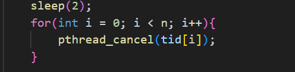
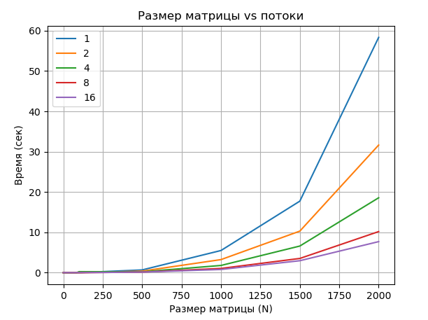

## Отчёт по лабораторной работе №16
###  Знакомство с POSIX потоками

Оценка 3:
1. C помощью pthread_create() создаём поток. Родительский и дочерний поток выводят по 5 строк.

2. Родительский поток выводит текст только
после завершения дочернего потока.

3. Основной поток создает 4 потока, 
исполняющих одну и ту же функцию, которая должна распечатать последовательность текстовых строк, переданных как параметр.

4. С помощью sleep() в функцию потоков добавлен сон между выводами строк. Спустя две секунды после создания дочерних потоков 
основной поток прерывает работу всех дочерних потоков с помощью pthread_cancel()

5. Дочерний поток перед завершение 
распечатывает сообщение: "Дочерний поток завершил работу" с помощью pthread_cleanup_push().

6. Реализация алгоритма сортировки Sleepsort. На вход подается массив из 26 элементов, состоящий 
из целочисленных значений. Для каждого элемента массива создается отдельный поток, в который в качестве аргумента передается значение элемента. Сам поток уходит в сон с помощью sleep() с параметром равным значению элемента массива, а после вывести на экран значение.

Оценка 4:

1.  Создаём родительский и дочерний мьютекс. С помощью мьютексов синхронизируем Вывод родительского и дочернего потока: сначала родительский поток 
выводит первую строку, затем дочерний, затем родительский 
вторую строку и т.д.

[task4_1.c](task4_1.c)

2. Пишем функцию произведения двух квадратных матриц A и B 
размером NxN и на выходе получаем матрицу C. Исходные матрицы 
A и B заполняем единицами в основном потоке. 
Для матриц размером меньше 5 в основном потоке выводим матрицы A, B и C. 
b. С командной строки считываем размер матрицы и количество потоков. 
Разбиваем матрицу на равные части между потоками в функции main, деля размер матрицы на количество потоков: N / threads.
[task4_2.c](task4_2.c)

3. Замеряем время выполнения с момента создания потоков и до завершения работы потоков. Строим график, который покажет зависимость времени 
выполнения от размера матрицы и количества потоков, с помощью библиотеки matplotlib языка python.

[plot.py](plot.py)
