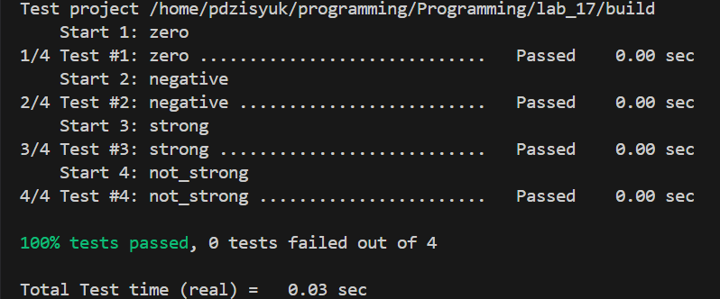

## Отчёт по лабораторной работе №17
### Тестирование ПО

Исходный код:\
https://github.com/TheAlgorithms/C/blob/master/math/strong_number.c

Были написаны 4 модульных теста:
1.
static void test_num_is_zero(void **state)
При значении аргумента равном 0 функция isStrong должна возвращать false.
2.
static void test_num_is_negative(void **state)
При отрицательном значении аргумента функция isStrong должна возвращать false.
3.
static void test_num_is_strong(void **state)
Если сумма факториалов цифр аргумента равна самому аргументы функция должна вернуть true.
Отдельно считаю сумму факториалов цифр числа 145 и проверяю, что сумма равна аргументу и сравниваю true с значением, что возвращает функция isStrong.
4.
static void test_num_is_not_strong(void **state)
Если сумма факториалов цифр аргумента равна самому аргументы функция должна вернуть true.
Отдельно считаю сумму факториалов цифр числа, не являющегося факториальным(сильным) и проверяю, что сумма не равна аргументу. Сравниваю false с значением, что возвращает функция isStrong.
[test_strong_number.c](test_strong_number.c)
Использую фреймворк cmocka.

Оценка 5:
Собираю проект с помощью CMakeLists, использую модуль CTest, и вывожу на экран результаты тестов в отформатированном виде.
